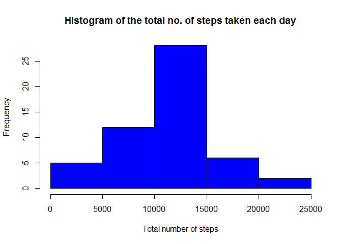
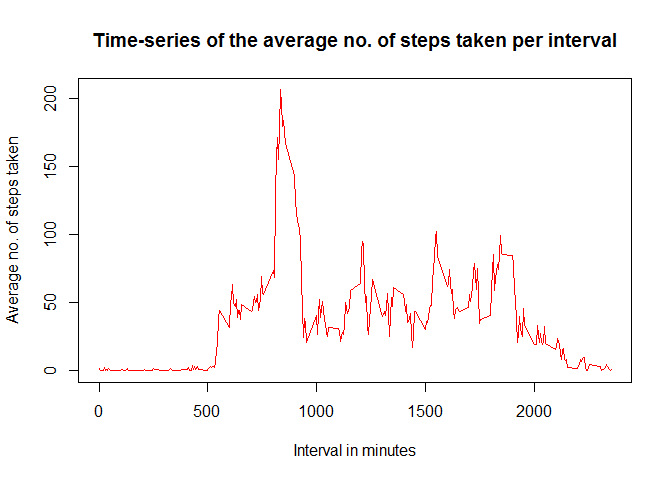
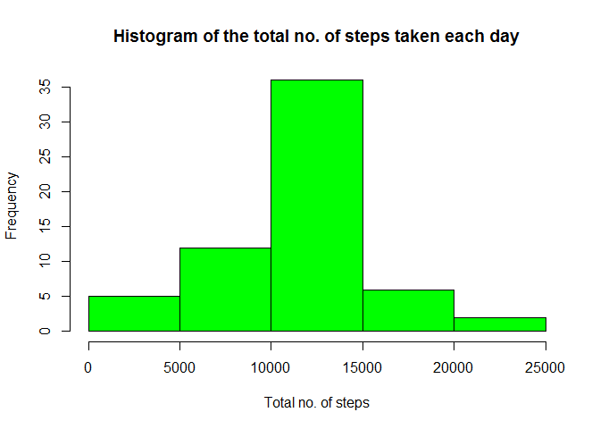
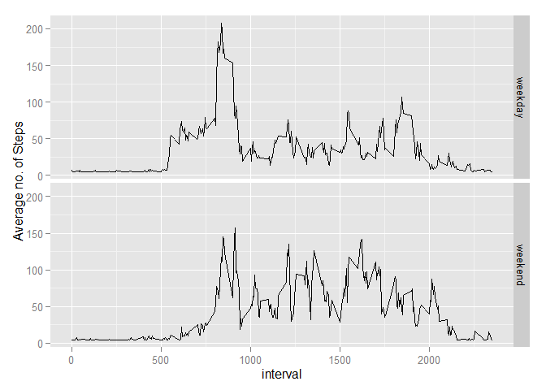

# Reproducible Research: Peer Assessment 1

###Loading and preprocessing the data

```r
Activity <- read.csv("activity.csv")

Activity$date <- as.Date(Activity$date, format = "%Y-%m-%d")
```

Loading required library

```r
library(ggplot2)
```

```
## Warning: package 'ggplot2' was built under R version 3.1.3
```


###What is the mean total number of steps taken per day?

```r
#Use aggregate to find total steps for each day
Total <- aggregate(steps ~ date, data = Activity, sum, na.rm = TRUE)

#Plot histogram
hist(Total$steps, 
     col="blue", 
     xlab="Total number of steps", 
     main="Histogram of the total no. of steps taken each day")
```

 

Mean of the total number of steps taken per day

```r
mean(Total$steps)
```

```
## [1] 10766.19
```

Median of the total number of steps taken per day

```r
median(Total$steps)
```

```
## [1] 10765
```


###What is the average daily activity pattern?

```r
mean_steps <- aggregate(Activity$steps, 
                        by=list(Activity$interval), 
                        mean, 
                        na.rm=TRUE)

names(mean_steps) <- c("interval", "mean")
```

Plotting the time series plot

```r
plot(mean_steps$interval, 
     mean_steps$mean, 
     type="l", 
     col="red", 
     lwd=1, 
     xlab="Interval in minutes", 
     ylab="Average no. of steps taken", 
     main="Time-series of the average no. of steps taken per interval")
```

 

Which 5-minute interval, on average across all the days in the dataset, contains the maximum number of steps?

```r
max_interval <- mean_steps[which.max(mean_steps$mean),]
max_interval
```

```
##     interval     mean
## 104      835 206.1698
```


###Imputing missing values

Calculate and report the total number of missing values in the dataset

```r
Missing_values <- sum(is.na(Activity))
Missing_values
```

```
## [1] 2304
```

Devise a strategy for filling in all of the missing values in the dataset. The strategy does not need to be sophisticated. For example, you could use the mean/median for that day, or the mean for that 5-minute interval, etc.

```r
#Find the NA positions
na_position <- which(is.na(Activity$steps))

#Find the mean
mean <- mean(Activity$steps, na.rm=TRUE)
```

Create a new dataset that is equal to the original dataset but with the missing data filled in.

```r
# Replace the NAs by the mean
Activity[na_position, "steps"] <- mean
```

Make a histogram of the total number of steps taken each day and Calculate and report the mean and median total number of steps taken per day. Do these values differ from the estimates from the first part of the assignment? What is the impact of imputing missing data on the estimates of the total daily number of steps?

```r
# Compute total no. of steps each day
Total_steps <- aggregate(Activity$steps, by=list(Activity$date), FUN=sum)

names(Total_steps) <- c("date", "total")

hist(Total_steps$total, 
     col="green", 
     xlab="Total no. of steps",  
     main="Histogram of the total no. of steps taken each day")
```

 

Mean of the total number of steps taken per day

```r
mean(Total_steps$total)
```

```
## [1] 10766.19
```

Median of the total number of steps taken per day

```r
median(Total_steps$total)
```

```
## [1] 10766.19
```

After imputing missing data, the mean is the same but the median is slight different.


###Are there differences in activity patterns between weekdays and weekends?

Create a new factor variable in the dataset with two levels - "weekday" and "weekend" indicating whether a given date is a weekday or weekend day.

```r
#Create a new variable and populate it with "weekday"
Activity$day <- "weekday"

#Repopulate "Saturday" & "Sunday" with "weekend"
Activity$day[weekdays(Activity$date) %in% c("Saturday","Sunday")] <- "weekend"
```

Make a panel plot containing a time series plot (i.e. type = "l") of the 5-minute interval (x-axis) and the average number of steps taken, averaged across all weekday days or weekend days (y-axis).

```r
Week_mean <- aggregate(Activity$steps, 
                       by=list(Activity$day, Activity$interval),
                       mean)

names(Week_mean) <- c("day", "interval", "mean")


qplot(x = interval, 
      y = mean, 
      data = Week_mean, 
      geom = c("line"), 
      facets = day~., 
      ylab = "Average no. of Steps")
```

 


